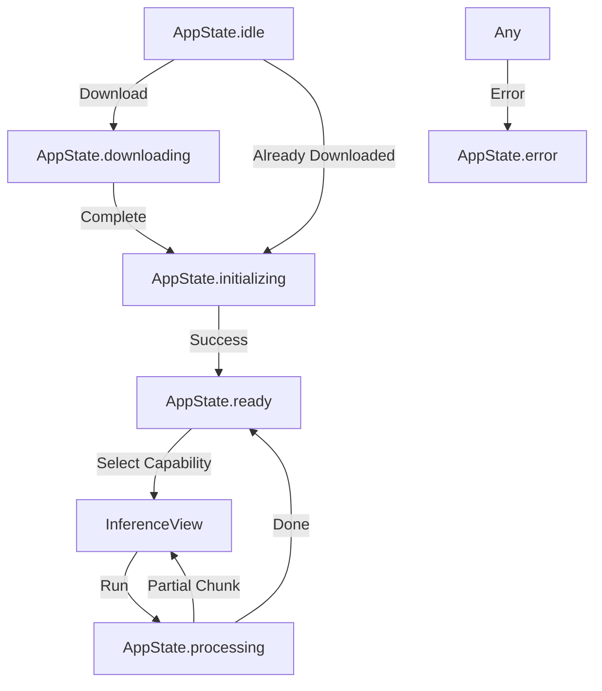

# Technical Documentation: Main View & Application Flow

This document details the architecture and execution flow of the **Iki Nano** application, specifically focusing on model selection, initialization, and inference navigation.

## 1. Architectural Overview

The application follows a **MVVM (Model-ViewModel-View)** pattern, leveraging SwiftUI's modern `Observation` framework for state management.

### Key Components:
- **`MainMenuView.swift`**: The entry point UI that presents model status and inference capabilities.
- **`MainViewModel.swift`**: The "brain" that coordinates between file services, inference services, and UI state.
- **`AppState.swift`**: An enum defining the finite states of the application (`idle`, `downloading`, `initializing`, `ready`, etc.).
- **`LLMInferenceService.swift`**: The low-level wrapper for the MediaPipe GenAI SDK.
- **`InferenceView.swift`**: A generic view that handles the lifecycle of a specific AI task (Summarization, Proofreading, etc.).

---

## 2. The Model Selection Flow

### Phase A: Model Management
1.  The user taps the "Modelo Activo" card in `MainMenuView`.
2.  `ModelManagementView` is presented, listing available models from `LLMModelRepository`.
3.  When a user selects a model, it is assigned to `viewModel.activeModel`.

### Phase B: Download & Verification
1.  The UI checks `viewModel.isModelDownloaded()`.
2.  If not present, the user clicks "Download". 
3.  `MainViewModel.downloadModel()` is called, which interacts with `ModelFileService`.
4.  The `AppState` transitions to `.downloading(progress: X)`.
5.  Upon completion, the app automatically transitions to the **Initialization** phase.

### Phase C: Initialization (Loading into Memory)
1.  `MainViewModel.initializeModel()` is triggered.
2.  The `AppState` becomes `.initializing`.
3.  `llmInferenceService.initialize(modelPath:)` is called. This loads the heavy `.bin` weights into the device's GPU/NPU memory.
4.  Once the MediaPipe `LlmInference` instance is created, `AppState` becomes `.ready`.

---

## 3. The Capability Selection Flow

Once the state is `.ready`, the "Capabilities" (Summarization, Proofreading, etc.) in the `MainMenuView` become enabled.

### Phase D: Navigation
1.  User selects a capability (e.g., **Summarization**).
2.  The `onCapabilitySelected` closure is triggered in `ContentView`.
3.  `ContentView` sets the `selectedCapability` and toggles `showInferenceView`.
4.  `InferenceView` is presented as a sheet, initialized with the specific `InferenceCapability`.

### Phase E: Inference Execution
1.  User enters text and taps **"Run Inference"**.
2.  `InferenceView.runInference()` is called:
    - It maps the `InferenceCapability` to an `InferenceTask` (which holds the prompt templates).
    - It builds a **Gemma-formatted prompt** (using `<start_of_turn>user...`).
    - It calls `llmInferenceService.generateResponseWithMetrics(...)`.
3.  **Streaming Logic**:
    - As the model generates tokens, `generateResponseStream` receives partial chunks.
    - These chunks are **accumulated** in `finalOutputText`.
    - The UI (`outputText` in `InferenceView`) is updated on the `MainActor` for every chunk.
4.  **Completion**:
    - When the model finishes, the final `InferenceMetrics` are returned.
    - The UI displays the final text and the performance card (Latency, TTFT, etc.).

---

## 4. State Diagram

## 5. Summary of State Bindings

- **ViewModel -> View**: The `@Observable` macro ensures that when `viewModel.state` or `viewModel.generatedResponse` changes, the UI updates automatically without manual notifications.
- **InferenceView**: Uses local `@State` for `inputText` and `outputText` to keep the specific task state isolated from the global menu state.
