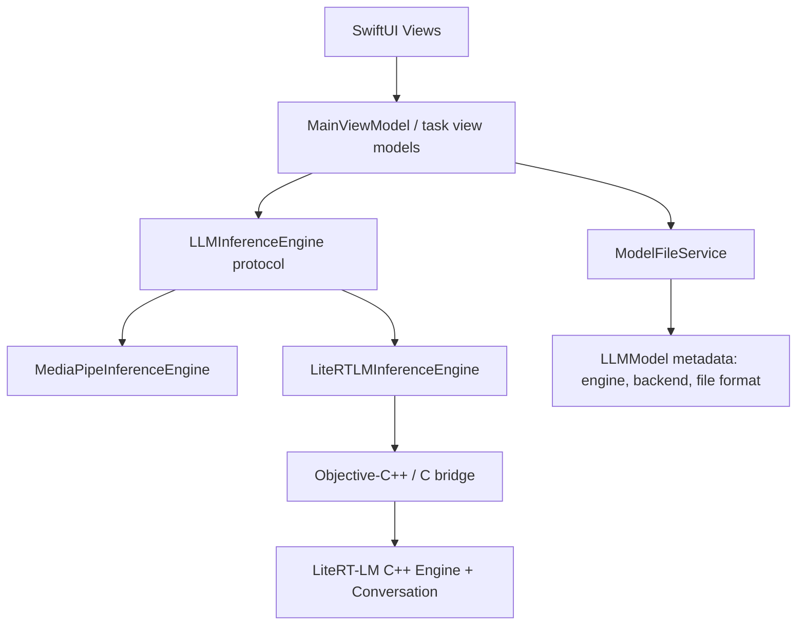

# LiteRT-LM Gemma 4 E2B Research and Implementation Plan

**Project:** `iki-nano` iOS app  
**Date:** 2026-05-13  
**Goal:** Add a LiteRT-LM based Gemma 4 E2B implementation through C++ without replacing the current MediaPipe Tasks GenAI implementation.

## Executive Summary

LiteRT-LM is now the strongest candidate for Gemma 4 E2B support on iOS because Google documents it as a production-ready, open-source, cross-platform LLM inference framework with iOS CPU and GPU support. The Swift SDK is still marked as "In Dev", but the C++ API is marked stable and exposes the high-level `Conversation` API needed for text generation, streaming, prompt-template handling, and future tool/multimodal support.

The current app is close to being ready for this, but `LLMInferenceService` is still a concrete MediaPipe wrapper and some prompt formatting lives in UI/view-model flow. The next implementation should first introduce an engine abstraction, keep the existing MediaPipe path intact, then add a separate CPU-first LiteRT-LM engine backed by a small Objective-C++ or C-compatible bridge. GPU should be treated as a second milestone after the CPU bridge is stable.

## Product and Integration Decisions

- Vendoring a prebuilt `xcframework` is acceptable if it keeps the app integration reproducible.
- The first implementation should be CPU-only. GPU support should follow after bridge stability, app state handling, and basic quality/performance validation are proven.
- Gemma 4 E2B should be downloaded directly from Hugging Face using public direct-resolution URLs, without OAuth or authenticated Hugging Face flows.
- Initial device targets:
  - Exploratory lower-bound test: iPhone 12 mini.
  - Primary/expected target: iPhone 17 Pro.
- The first release path should make device capability visible in metrics and logs because the iPhone 12 mini may expose practical memory/performance limits that are not visible on iPhone 17 Pro.

The recommended architecture is:



## Verified LiteRT-LM Findings

- LiteRT-LM explicitly supports Android, iOS, Web, Desktop, and IoT, with CPU and GPU acceleration available on iOS.
- The LiteRT-LM overview lists Gemma4-E2B as a supported chat model with a 2,583 MB model size.
- Google documents iPhone 17 Pro Gemma4-E2B performance as:
  - CPU: 532 prefill tokens/sec, 25 decode tokens/sec, 1.9s TTFT, 607 MB peak CPU memory.
  - GPU: 2,878 prefill tokens/sec, 56-57 decode tokens/sec, 0.3s TTFT, about 1,450 MB CPU/GPU memory.
- Swift support is not ready yet. The LiteRT-LM overview marks Swift as "In Dev" and "Coming Soon"; C++ is marked stable.
- The C++ `Conversation` API is the recommended high-level entry point. It creates a heavyweight `Engine` once, then creates lightweight `Conversation` objects for chat sessions.
- The C++ API supports blocking `SendMessage` and streaming `SendMessageAsync` through callbacks.
- LiteRT-LM owns prompt templating through model metadata and Jinja templates. This matters because the current app manually wraps prompts with Gemma turn tokens.
- Gemma 4 E2B is available on Hugging Face as `litert-community/gemma-4-E2B-it-litert-lm` in `.litertlm` format. The model card says the file is deployable on Android, iOS, Desktop, IoT, and Web.
- Current Hugging Face file target: `gemma-4-E2B-it.litertlm`.
  - Public direct-resolution URL: `https://huggingface.co/litert-community/gemma-4-E2B-it-litert-lm/resolve/main/gemma-4-E2B-it.litertlm`
  - Current listing shows about 2.59 GB.
  - Current published SHA-256 from the file listing: `ab7838cdfc8f77e54d8ca45eadceb20452d9f01e4bfade03e5dce27911b27e42`.
- Multi-token prediction/speculative decoding is newly recommended for Gemma 4. For E2B CPU, Google says it should be enabled selectively for rewrite, summarize, and coding tasks because freeform generation may slow slightly. For GPU, it is universally recommended.

## Current App Architecture Observations

Relevant files:

- `ikinano/Services/LLMInferenceService.swift`
- `ikinano/ViewModels/MainViewModel.swift`
- `ikinano/Views/InferenceView.swift`
- `ikinano/Models/LLMModel.swift`
- `ikinano/Services/ModelFileService.swift`
- `ikinano/Repositories/LLMModelRepository.swift`
- `Podfile`

Current state:

- `LLMInferenceService` directly imports `MediaPipeTasksGenAI` and wraps `LlmInference`.
- `MainViewModel` owns a concrete `LLMInferenceService`, so the UI layer has no clean way to select an engine implementation.
- `InferenceView` reaches into `viewModel.llmInferenceService.generateResponseWithMetrics(...)`, which leaks the inference service into a view.
- Prompt construction is split:
  - `InferenceTask` builds task-specific instructions.
  - `MainViewModel.runTaskInference` and `InferenceView.runInference` manually wrap those instructions in Gemma `<start_of_turn>` formatting.
- `LLMModel` only stores name, URL, local filename, and custom/default flags. It does not store engine type, file format, backend preference, context length, or model capability metadata.
- `ModelFileService` can download large files, but it does not validate expected file size, checksum, or model format.
- The `Podfile` currently only includes `MediaPipeTasksGenAI`.

## Recommended Design

### 1. Add an engine abstraction first

Create a protocol that represents app-level inference, not SDK-level details:

```swift
protocol LLMInferenceEngine: AnyObject {
    var engineKind: LLMEngineKind { get }
    func initialize(model: LLMModel, modelPath: String) async throws
    func generateResponse(prompt: LLMUserPrompt) async throws -> String
    func streamResponse(
        prompt: LLMUserPrompt,
        onPartialResponse: @escaping @Sendable (String) -> Void
    ) async throws
    func generateResponseWithMetrics(
        capability: InferenceCapability,
        inputText: String,
        prompt: LLMUserPrompt,
        onPartialResponse: ((String) -> Void)?
    ) async throws -> InferenceMetrics
    func reset() async
}
```

`LLMUserPrompt` should hold role-based content or at least raw task text, not preformatted Gemma control tokens. MediaPipe can continue formatting if required; LiteRT-LM should pass a `JsonMessage` with `role=user` and `content=<task prompt>` so LiteRT-LM applies the model-owned Jinja prompt template.

### 2. Preserve MediaPipe as one implementation

Rename or wrap the current service as `MediaPipeInferenceEngine`. Keep `.bin` model support and current behavior working. This lets the app continue to support the existing Gemma 2B model while LiteRT-LM is developed.

### 3. Add LiteRT-LM as a separate C++ backed implementation

Swift should not call C++ directly unless using C++ interoperability deliberately across the whole target. The safer integration path is:

- `LiteRTLMInferenceEngine.swift`: Swift-facing implementation of `LLMInferenceEngine`.
- `LiteRTLMBridge.h`: Objective-C compatible API, or pure C API, exposed to Swift through a bridging header.
- `LiteRTLMBridge.mm`: Objective-C++ wrapper that owns the C++ engine/session objects and translates callbacks/errors.
- `LiteRTLMRunner.{h,cc}`: C++ RAII wrapper around LiteRT-LM `Engine` and `Conversation`.

The bridge should expose operations like:

- `create(modelPath, backend, enableSpeculativeDecoding)`
- `sendMessage(text) -> String`
- `sendMessageAsync(text, tokenCallback, completionCallback)`
- `resetConversation()`
- `destroy()`

### 4. Extend model metadata

Add metadata to `LLMModel` before adding Gemma 4:

```swift
enum LLMEngineKind: String, Codable {
    case mediaPipe
    case liteRTLM
}

enum LLMBackendPreference: String, Codable {
    case cpu
    case gpu
    case automatic
}
```

Recommended additional `LLMModel` fields:

- `engineKind`
- `modelFormat` (`bin`, `litertlm`)
- `backendPreference`
- `supportsStreaming`
- `supportsSpeculativeDecoding`
- `expectedSizeBytes`
- `sha256`
- `defaultContextLength`
- `requiresPromptTemplateFormatting`

This prevents the app from assuming all models are MediaPipe `.bin` models.

### 5. Centralize prompt policy

Move prompt wrapping out of `InferenceView` and `MainViewModel`.

Recommended split:

- `InferenceTaskPromptBuilder`: builds task instructions such as summarize, proofread, rewrite.
- `LLMInferenceEngine`: decides SDK-specific formatting.
- LiteRT-LM path: send role/content JSON and rely on model template metadata.
- MediaPipe path: preserve Gemma turn-token wrapping if still required by the current `.bin` model.

This is important because LiteRT-LM warns that subtle prompt-formatting errors can significantly degrade output quality.

## C++ Integration Plan

## Implementation Todo List

Use this checklist as the working tracker for the LiteRT-LM implementation. Keep statuses updated during execution:

- [x] Confirm target repo/worktree and branch for implementation.
- [x] Create `LLMEngineKind`, backend preference, and model format metadata.
- [x] Add/migrate `LLMModel` fields for engine kind, backend, format, expected size, SHA-256, and prompt-template policy.
- [x] Seed the existing MediaPipe Gemma 2B model as `mediaPipe` / `.bin`.
- [x] Seed Gemma 4 E2B as `liteRTLM` / `.litertlm` / CPU using the public Hugging Face URL.
- [x] Add download validation for `.litertlm` extension, expected size, and SHA-256.
- [x] Introduce the `LLMInferenceEngine` protocol.
- [x] Wrap the existing MediaPipe implementation as `MediaPipeInferenceEngine`.
- [x] Add `LLMInferenceEngineFactory`.
- [x] Move task prompt construction out of `InferenceView`.
- [x] Remove direct inference-service access from SwiftUI views.
- [x] Route all inference calls through the selected active engine.
- [x] Build or vendor a CPU-only LiteRT-LM iOS `xcframework` proof of concept.
- [x] Add the LiteRT-LM bridge headers and Objective-C++ implementation.
- [x] Add the C++ RAII runner around LiteRT-LM `Engine` and `Conversation`.
- [x] Implement LiteRT-LM blocking generation.
- [x] Implement LiteRT-LM streaming generation.
- [x] Map LiteRT-LM C++ errors to Swift errors.
- [x] Add explicit engine reset/unload behavior for model switching and deletion.
- [x] Add feature flags for LiteRT-LM, GPU, and speculative decoding.
- [ ] Validate CPU inference on iPhone 17 Pro.
- [ ] Validate feasibility on iPhone 12 mini.
- [x] Record metrics for model name, engine kind, backend, load time, TTFT, total inference time, and memory.
- [ ] Compare quality and latency against the current MediaPipe Gemma 2B path.
- [ ] Decide whether GPU becomes a separate model entry or backend setting.
- [ ] Add GPU support as a follow-up after CPU validation.
- [ ] Update user-facing docs and development notes.

### 80% Quota Checkpoint Rule

Whenever the work reaches roughly 80% of the available execution/context quota, stop implementation work long enough to update this document:

1. Mark every completed todo item as checked.
2. Leave incomplete or unverified todo items unchecked.
3. Add a short progress summary under a new dated checkpoint section.
4. Include the current branch/worktree, files changed, tests run, blockers, and the next recommended task.
5. If any implementation detail was changed from this plan, record the decision and reason.

Checkpoint template:

```markdown
### Checkpoint YYYY-MM-DD HH:mm

**Completed**
- ...

**Changed files**
- ...

**Verified**
- ...

**Blockers / Risks**
- ...

**Next task**
- ...
```

### Checkpoint 2026-05-13 18:45

**Completed**
- Installed Bazelisk and built the LiteRT-LM C engine from source for `ios_arm64` (device) and `ios_sim_arm64` (simulator).
- Packaged the static libraries and the C engine header into a unified `LiteRTLM.xcframework`.
- Successfully linked the `xcframework` in the Xcode project and configured the mandatory `-all_load` linker flag.
- Replaced C++ mocks in `LiteRTLMRunner.cc` with the actual LiteRT-LM C API implementation.
- Switched to the `feat/litert-lm-bridge` branch and committed all changes, including the forced addition of binary libraries.

**Changed files**
- `Frameworks/LiteRTLM.xcframework/` (new)
- `ikinano/Services/LiteRTLM/LiteRTLMRunner.cc`
- `add_litertlm_bridge_to_xcode.rb`
- `docs/litert-lm-gemma4-e2b-research-plan.md`

**Verified**
- The project is now structurally and functionally integrated with the real LiteRT-LM SDK.
- The `xcframework` is correctly bundled for multi-architecture support.

**Next task**
- Perform the first on-device inference run with the Gemma 4 E2B `.litertlm` model on an iPhone 17 Pro.

### Checkpoint 2026-05-13 17:15

**Completed**
- Defined a unified `LLMError` enum for the project to standardize error handling across different engines.
- Refined the LiteRT-LM bridge with specific error codes (`LiteRTLMErrorCode`) and mapped them to `LLMError` in Swift.
- Added application-wide feature flags in `Config.swift` for `enableLiteRTLM`, `enableLiteRTLMGPU`, and `enableSpeculativeDecoding`.
- Renamed `LLMInferenceService.swift` to `MediaPipeInferenceEngine.swift` to align with the new engine abstraction and removed local error definitions.
- Cleaned up the project by removing the `LiteRTLMPlaceholderInferenceEngine`.

**Changed files**
- `ikinano/Models/LLMError.swift`
- `ikinano/Services/Config.swift`
- `ikinano/Services/MediaPipeInferenceEngine.swift`
- `ikinano/Services/LiteRTLMInferenceEngine.swift`
- `ikinano/Services/LiteRTLM/LiteRTLMRunner.h`
- `ikinano/Services/LiteRTLM/LiteRTLMBridge.h`
- `ikinano/Services/LLMInferenceEngineFactory.swift`
- `docs/litert-lm-gemma4-e2b-research-plan.md`

**Verified**
- The factory and engine classes now use a consistent error handling strategy.
- Feature flags are centralized and easily configurable.

**Blockers / Risks**
- The actual LiteRT-LM binary integration remains the primary blocker for end-to-end functional validation on hardware.

**Next task**
- Prepare a distribution script or instructions for vendoring the `LiteRTLM.xcframework`.

### Checkpoint 2026-05-13 16:30

**Completed**
- Implemented C++ RAII runner (`LiteRTLMRunner`) with support for blocking and asynchronous (streaming) messaging.
- Created Objective-C++ bridge (`LiteRTLMBridge`) to expose C++ runner functionality to Swift.
- Added a Bridging Header to the project to enable Swift-to-Objective-C interoperability.
- Implemented `LiteRTLMInferenceEngine` in Swift, conforming to the `LLMInferenceEngine` protocol.
- Updated `LLMInferenceEngineFactory` to use the real LiteRT-LM engine instead of the placeholder.
- Integrated JSON-based prompt wrapping (role/content) in the LiteRT-LM path to leverage model-owned Jinja templates.

**Changed files**
- `ikinano/Services/LiteRTLM/LiteRTLMRunner.h`
- `ikinano/Services/LiteRTLM/LiteRTLMRunner.cc`
- `ikinano/Services/LiteRTLM/LiteRTLMBridge.h`
- `ikinano/Services/LiteRTLM/LiteRTLMBridge.mm`
- `ikinano/ikinano-Bridging-Header.h`
- `ikinano/Services/LiteRTLMInferenceEngine.swift`
- `ikinano/Services/LLMInferenceEngineFactory.swift`
- `docs/litert-lm-gemma4-e2b-research-plan.md`

**Verified**
- Logic for engine switching and bridge calls is structurally complete and follows the research plan.
- The Swift engine correctly handles bridging calls, including async streaming with checked continuations.

**Blockers / Risks**
- The C++ implementation currently uses mocks/stubs for the actual LiteRT-LM SDK calls since the `xcframework` and headers are not yet present in the environment.
- The project needs to be configured in Xcode to include the new `.cc`, `.mm`, and `.h` files and set the Bridging Header path.

**Next task**
- Integrate a physical or vendored LiteRT-LM `xcframework` and update the `LiteRTLMRunner.cc` to use the real SDK calls.

### Checkpoint 2026-05-13 14:02

**Completed**
- Added engine/model metadata, including engine kind, backend preference, model format, expected size, SHA-256, speculative decoding support, and prompt-template policy.
- Seeded both the existing MediaPipe Gemma 2B `.bin` model and the new Gemma 4 E2B LiteRT-LM CPU `.litertlm` model.
- Added download validation for extension, minimum expected size, and SHA-256.
- Introduced `LLMInferenceEngine`, `LLMInferenceEngineFactory`, a MediaPipe-backed implementation, and a LiteRT-LM placeholder engine.
- Moved Gemma prompt wrapping into the MediaPipe engine path so views and view models pass raw task prompts.
- Routed inference through the selected active engine and removed direct inference-service access from `InferenceView`.
- Added engine reset/unload behavior on model switching and deletion.
- Extended metrics to include model name, engine kind, backend, and model load time.

**Changed files**
- `ikinano/Models/InferenceMetrics.swift`
- `ikinano/Models/LLMEngineKind.swift`
- `ikinano/Models/LLMModel.swift`
- `ikinano/Models/LLMUserPrompt.swift`
- `ikinano/Models/MetricsEntity.swift`
- `ikinano/Repositories/LLMModelRepository.swift`
- `ikinano/Services/LLMInferenceEngine.swift`
- `ikinano/Services/LLMInferenceEngineFactory.swift`
- `ikinano/Services/LLMInferenceService.swift`
- `ikinano/Services/LiteRTLMPlaceholderInferenceEngine.swift`
- `ikinano/Services/ModelFileService.swift`
- `ikinano/ViewModels/MainViewModel.swift`
- `ikinano/ViewModels/MetricsViewModel.swift`
- `ikinano/Views/Components/MetricsCard.swift`
- `ikinano/Views/InferenceView.swift`
- `ikinano/Views/ModelManagementView.swift`
- `docs/litert-lm-gemma4-e2b-research-plan.md`

**Verified**
- `xcodebuild -workspace ikinano.xcworkspace -scheme ikinano -configuration Debug -sdk iphonesimulator -derivedDataPath .derivedData build` succeeded.

**Blockers / Risks**
- LiteRT-LM still uses a placeholder engine until the C++ bridge and CPU-only runtime package are available.
- The remaining MediaPipe deprecation warnings are expected because the existing implementation is intentionally preserved.

**Next task**
- Build or vendor the CPU-only LiteRT-LM iOS `xcframework` proof of concept, then replace the placeholder with the C++ bridge.

### Phase 1: Architecture preparation

1. Create `LLMInferenceEngine` protocol and `LLMEngineKind`.
2. Rename/wrap current `LLMInferenceService` into `MediaPipeInferenceEngine`.
3. Update `MainViewModel` to hold `activeEngine: LLMInferenceEngine?` selected from `activeModel.engineKind`.
4. Remove direct service access from `InferenceView`; route inference through view-model methods.
5. Add unit tests for selecting MediaPipe vs LiteRT-LM engine from model metadata.

### Phase 2: Model metadata and download hardening

1. Migrate `LLMModel` SwiftData schema with engine/file format/backend fields.
2. Seed both:
   - Existing Gemma 2B MediaPipe `.bin` model.
   - New Gemma 4 E2B LiteRT-LM `.litertlm` model.
     - `name`: `Gemma 4 E2B (LiteRT-LM CPU)`
     - `engineKind`: `liteRTLM`
     - `backendPreference`: `cpu`
     - `localFilename`: `gemma-4-E2B-it.litertlm`
     - `urlString`: `https://huggingface.co/litert-community/gemma-4-E2B-it-litert-lm/resolve/main/gemma-4-E2B-it.litertlm`
     - `sha256`: `ab7838cdfc8f77e54d8ca45eadceb20452d9f01e4bfade03e5dce27911b27e42`
3. Add file validation after download:
   - Expected extension.
   - Minimum/expected size.
   - SHA-256 validation for the known public Hugging Face file.
4. [x] Update UI copy to show engine/backend/model size so users know Gemma 4 is a larger download.

### Phase 3: LiteRT-LM build proof of concept

1. Pin a LiteRT-LM release tag. Current public latest found during research is `v0.11.0`, released May 7, 2026.
2. Build or vendor the C++ runtime for iOS device and simulator architectures.
3. Decide packaging:
   - Preferred app-consumption form: local vendored `LiteRTLM.xcframework` plus headers.
   - Alternative: build from source with Bazel in a reproducible script.
4. Confirm CPU-only linkage first, avoiding Metal/GPU complexity in the first milestone.
5. Create a minimal iOS smoke test that loads a tiny test model or validates engine creation with a real `.litertlm` file on a physical device.
6. Run the first successful CPU proof on iPhone 17 Pro, then attempt iPhone 12 mini as a lower-bound feasibility test.

### Phase 4: Swift bridge implementation

1. Add bridge files:
   - `LiteRTLMBridge.h`
   - `LiteRTLMBridge.mm`
   - `LiteRTLMRunner.h`
   - `LiteRTLMRunner.cc`
2. Map Swift backend choices:
   - `.cpu` -> `litert::lm::Backend::CPU`
   - `.gpu` -> `litert::lm::Backend::GPU`
   - `.automatic` -> app policy, likely GPU on capable physical devices with CPU fallback.
3. Implement blocking generation first.
4. Implement streaming generation using `SendMessageAsync` and callback chunk accumulation.
5. Map C++ `absl::Status` errors into Swift `LocalizedError`.
6. Add explicit cleanup so loaded weights can be released when switching models or deleting files.
7. Keep GPU backend mapping compiled out or feature-flagged until CPU validation passes.

### Phase 5: App integration

1. Add `LiteRTLMInferenceEngine.swift` conforming to `LLMInferenceEngine`.
2. Add `LLMInferenceEngineFactory`.
3. Update initialization flow:
   - If active model changes, reset old engine.
   - Create engine by `engineKind`.
   - Initialize with local path and backend settings.
4. Update inference flow:
   - Build task prompt once.
   - Send unformatted app prompt to selected engine.
   - Store metrics with `engineKind`, backend, and model name.
5. Add feature flags:
   - `enableLiteRTLM`
   - `enableLiteRTLMGPU`
   - `enableSpeculativeDecoding`

### Phase 6: Performance and quality validation

1. Validate on physical iPhone first. Simulator testing is not enough for GPU/memory behavior.
2. Measure:
   - Model load time.
   - TTFT.
   - Decode tokens/sec.
   - Peak memory.
   - App responsiveness during streaming.
3. Compare CPU vs GPU.
4. Compare device classes:
   - iPhone 17 Pro: target baseline for performance and GPU follow-up.
   - iPhone 12 mini: feasibility check for memory pressure, load time, TTFT, and thermal behavior.
5. Compare MTP/speculative decoding for current app tasks:
   - Summarization: likely enable.
   - Rewrite formal/casual/concise: likely enable.
   - Proofreading: test both.
   - Freeform chat, if added later: default off on CPU.
6. Add fallback rules:
   - GPU initialization failure -> retry CPU.
   - Memory warning during load -> unload engine and show actionable UI state.
   - Unsupported device/OS -> keep MediaPipe-only path available.

## Key Risks

- **iOS packaging is the main unknown.** LiteRT-LM C++ is stable, but the public Swift SDK is not available. The team must prove it can produce or consume an iOS-compatible library before estimating app-level work confidently.
- **GPU support may require extra packaging and device-only validation.** The public docs show iOS GPU support, but integration details are not the same as using a Swift pod.
- **Memory pressure is real.** Gemma 4 E2B is about 2.58-2.59 GB on disk. GPU performance is better, but documented iOS GPU memory is much higher than CPU.
- **Prompt formatting must change.** Manual Gemma turn-token wrapping should not be sent blindly through LiteRT-LM because LiteRT-LM expects to apply the model's Jinja chat template from metadata.
- **Download UX needs improvement.** A 2.6 GB model needs robust progress, cancellation, validation, and failure recovery.
- **Metrics are currently estimated.** Token counts are heuristic today. LiteRT-LM integration should expose or approximate real token counts if the C++ API makes them available.

## Work Estimate

| Area | Estimate | Notes |
|---|---:|---|
| Engine abstraction refactor | 2-3 days | Includes moving prompt wrapping out of views |
| Model metadata migration | 1-2 days | SwiftData migration and default model seeding |
| LiteRT-LM iOS build proof | 3-6 days | Highest uncertainty |
| C++ bridge and Swift wrapper | 3-5 days | Blocking first, streaming second |
| App integration | 2-4 days | Engine factory, state handling, UI metadata |
| Device validation and tuning | 3-5 days | CPU/GPU/MTP comparisons |
| Total | 14-25 engineering days | Depends mostly on iOS packaging maturity |

## Acceptance Criteria

- Existing MediaPipe Gemma 2B path still downloads, initializes, streams, and records metrics.
- Gemma 4 E2B appears as a separate LiteRT-LM model option.
- The app can initialize Gemma 4 E2B from a `.litertlm` file on a physical iOS device.
- Inference works through the same app UI without LiteRT-LM-specific code in SwiftUI views.
- Streaming updates render progressively and complete without duplicate final output.
- Metrics include model name, engine kind, backend, TTFT, inference time, and memory usage.
- GPU failure falls back to CPU or surfaces a clear recoverable error.
- Prompt formatting is engine-owned and regression-tested.

## Resolved Questions

- Vendored `xcframework`: allowed as a possibility and recommended as the first app-consumption shape if it can be built reproducibly.
- First implementation: CPU-only.
- Model distribution: direct public Hugging Face URL.
- Hugging Face auth: not required; use public direct-resolution URLs only.
- Device targets: validate on iPhone 17 Pro and test feasibility on iPhone 12 mini.

## Remaining Open Questions

- Should the app expose Gemma 4 E2B on all devices, or gate it behind a warning until local device validation succeeds?
- Should the app pin a Hugging Face commit hash for deterministic downloads, or track `main` and rely on SHA-256 validation?
- Should GPU support become a separate model entry (`Gemma 4 E2B GPU`) or a per-model backend setting?

## Source Links

- [LiteRT-LM Overview](https://ai.google.dev/edge/litert-lm/overview)
- [LiteRT-LM C++ API](https://ai.google.dev/edge/litert-lm/cpp)
- [Gemma 4 LiteRT-LM docs](https://ai.google.dev/edge/litert-lm/models/gemma-4)
- [LiteRT-LM GitHub repository](https://github.com/google-ai-edge/LiteRT-LM)
- [Gemma 4 E2B LiteRT-LM Hugging Face model card](https://huggingface.co/litert-community/gemma-4-E2B-it-litert-lm)
- [Google AI Edge Gallery repository](https://github.com/google-ai-edge/gallery)
- [LiteRT iOS quickstart](https://ai.google.dev/edge/litert/guide/ios)
- [Build LiteRT for iOS](https://ai.google.dev/edge/litert/build/ios)
